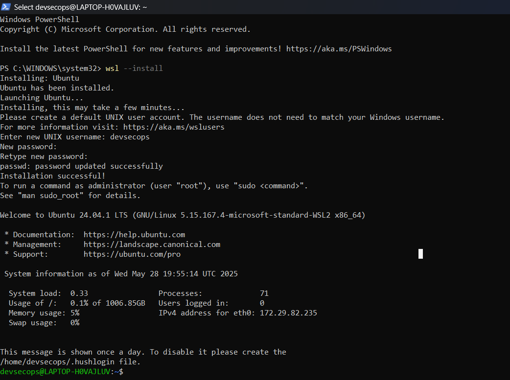

## Configure WSL for Windows 

### 1. Install Ubuntu on WSL
Use the following command to  install ubuntu on WSL

Open powershell in administrative mode and execute the following command
```
wsl --install
```
After Ubuntu is downloaded, the prompt will ask to add a username and password as follows: <br><br>


### 2. Set Ubuntu as Default WSL Distribution

Use the list command to show available distro for WSL
Set the Ubuntu Distro as Default using the following commands
```
wsl --list
wsl --set-default ubuntu
```

Run update commands for ubuntu
```
sudo apt update
sudo apt full-upgrade -y
```

### 3. Create a Working Directory in Ubuntu
Navigate to the `/home` directory and create a new work folder. <br>
Use this for working on all the hands on practice project.

Clone the [The_DevSecOps_Series_HandsOn_Practice_Project](https://github.com/ManthanDhole/The_DevSecOps_Series_HandsOn_Practice_Projects) repository using the following command

```
git clone git@github.com:ManthanDhole/The_DevSecOps_Series_HandsOn_Practice_Projects.git
```